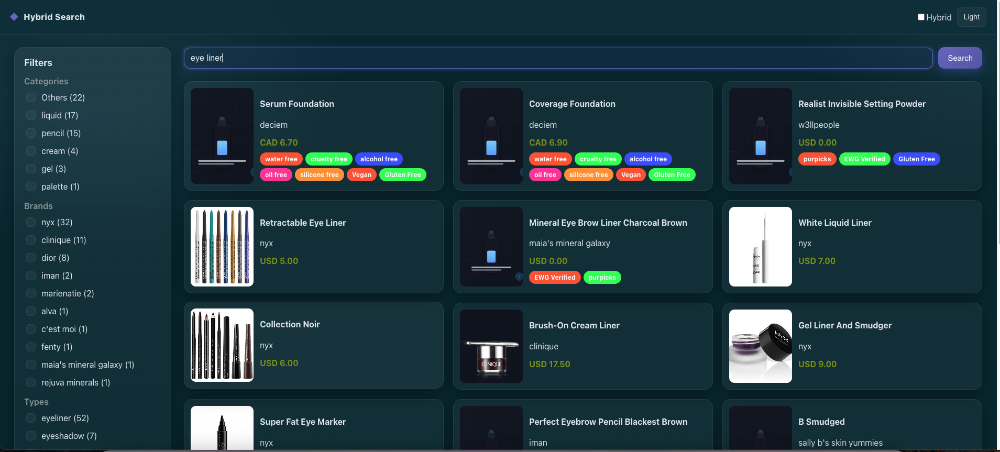

# Hybrid Search Product Store (Front-end and API)

This project consists of two main components: a front-end application and an API. Together, they form a product search platform where users can browse, search, and filter products using a hybrid search mechanism that combines lexical and semantic techniques.

## Working Demo




## Project Structure

- **Front-end**: A React application responsible for displaying products, handling user interactions, and performing searches via the API.
- **API**: A backend service that provides product data and search capabilities, including faceted filtering and hybrid search logic.

### Front-end

- Built with **React**.
- Handles product display, search, and filtering.
- Communicates with the API to retrieve and display products.
  
### API

- Developed with Python
- Provides endpoints for fetching product data and handling search/filter requests.
- Implements hybrid search combining lexical and semantic search techniques.

## Getting Started

### Front-end Setup

1. Read: [README.md](app-product-store%2FREADME.md)

### API Setup

1. Read: [README.md](product-store-search%2FREADME.md)

---

# Full Run Guide

This guide shows how to run the stack with or without Docker.

## Prerequisites

- Node.js 18+
- Python 3.10+
- Elasticsearch 9.x (via Docker or local install)

Default Elasticsearch dev credentials:
- URL: http://localhost:9200
- Username: elastic
- Password: changeme

These are referenced in:
- `backend/api/api.py` → `get_client_es()`
- `backend/ingestion/ingestion.py` → `get_client_es()`
- `backend/infra/create_index.py` → `get_client_es()`

### Environment variables

Backend loads settings from environment variables (via `python-dotenv`). Create `backend/.env` from the example:

```bash
cp backend/.env.example backend/.env
```

Available variables:

```env
ES_HOST=http://localhost:9200
ES_USERNAME=elastic
ES_PASSWORD=changeme
```

These are used by the API, ingestion, and index creation scripts.

## Run with Docker (Recommended for ES)

1) Start Elasticsearch + Kibana

```bash
cd backend/docker
docker compose up -d
```

- Elasticsearch: http://localhost:9200
- Kibana: http://localhost:5601

2) Create index and mappings

```bash
cd ../infra
python create_index.py
```

3) Ingest dataset with vectors

```bash
cd ../ingestion
python ingestion.py
```

4) Run the backend API (FastAPI)

```bash
cd ../api
python -m pip install -r ../requirements.txt
uvicorn api:app --host 127.0.0.1 --port 5000 --reload
```

5) Run the frontend (React)

```bash
cd ../../frontend
npm install
npm start
```

Open http://127.0.0.1:3000 (frontend) → API at http://127.0.0.1:5000.

## Run without Docker

1) Install and start Elasticsearch 9.x locally with:

- `xpack.security.enabled=true`
- `discovery.type=single-node`
- Heap (example): `-Xms4g -Xmx4g`

2) Create index and ingest

```bash
# terminal A
cd backend/infra
python create_index.py

# terminal B
cd ../ingestion
python ingestion.py
```

3) Start backend API

```bash
cd backend/api
python -m pip install -r ../requirements.txt
uvicorn api:app --host 127.0.0.1 --port 5000 --reload
```

4) Start frontend

```bash
cd frontend
npm install
npm start
```

## Endpoints (Backend)

- `GET /api/products/search` — query with optional facets and `hybrid=true`
- `GET /api/products/facets` — facet counts
- `GET /api/products/id/{product_id}` — product details
- `GET /api/products/suggest` — autocomplete

## Troubleshooting

- If API can’t reach ES: check `localhost:9200`, credentials, and index creation.
- Hybrid search errors: ensure index created via `backend/infra/create_index.py` and data ingested.
- Frontend CORS/issues: API runs on 127.0.0.1:5000; URLs are hard-coded in `frontend/src/App.js`.
- Slow ingestion: first run downloads `sentence-transformers/all-MiniLM-L6-v2` model.

## Quickstart Script (copy/paste)

```bash
cd backend/docker && docker compose up -d \
&& cd ../infra && python create_index.py \
&& cd ../ingestion && python ingestion.py \
&& cd ../api && uvicorn api:app --host 127.0.0.1 --port 5000 --reload
```

In another terminal:

```bash
cd frontend && npm install && npm start
```
